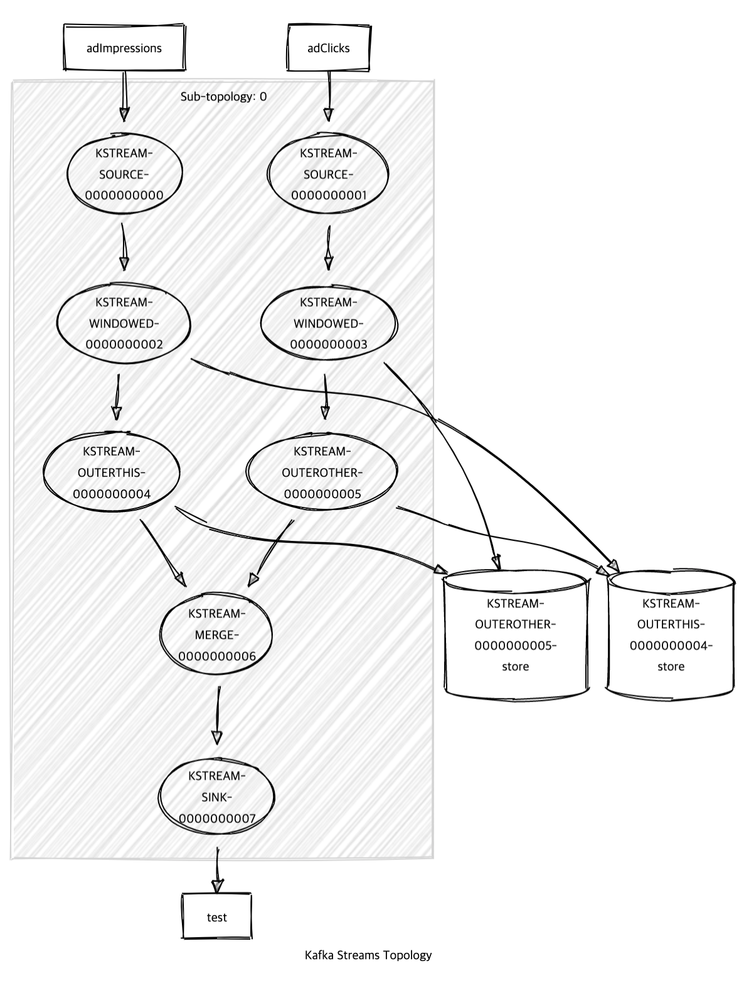

# StreamToStreamJoinIntegrationTest

이 레포지토리는 KStream과 KStream을 join()하기 위한 예제를 보여줍니다. confluent에서 공개한 kafka-streams-examples에 수록된 테스트 중 하나입니다.

링크 : https://github.com/confluentinc/kafka-streams-examples

## 토폴로지



## 동작방법

1. 토픽생성

```
$ ./kafka-topics.sh --bootstrap-server localhost:9092 --topic adImpressions --partitions 10 --create
Created topic adImpressions.
$ ./kafka-topics.sh --bootstrap-server localhost:9092 --topic adClicks --partitions 10 --create
Created topic adClicks.
```

2. 애플리케이션 실행

cmd + r

3. 데이터 넣기 

```
$ ./kafka-console-producer.sh --bootstrap-server localhost:9092 --topic adImpressions --property "parse.key=true" --property "key.separator=:"
>car-advertisement:shown
>newspaper-advertisement:shown
>gadget-advertisement:shown
```

```
$ ./kafka-console-producer.sh --bootstrap-server localhost:9092 --topic adClicks --property "parse.key=true" --property "key.separator=:"
>newspaper-advertisement:clicked
>gadget-advertisement:clicked
>newspaper-advertisement:clicked
```
